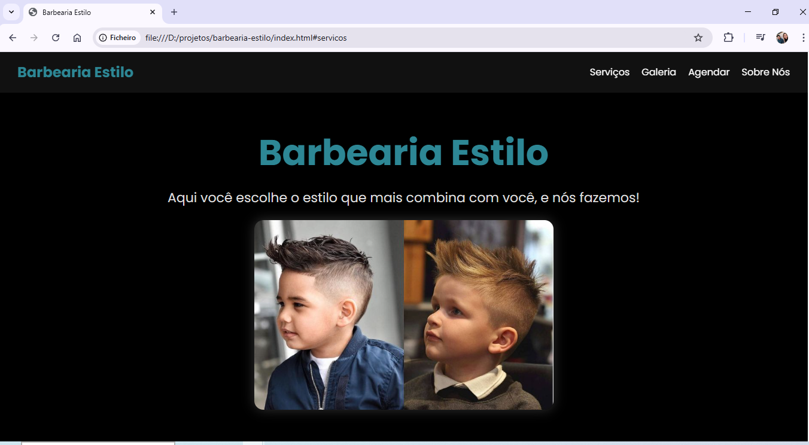

# 💈 Barbearia Estilo

Site desenvolvido para a **Barbearia Estilo**, uma barbearia especializada em cortes infantis, com foco em visual limpo, responsivo e direto ao ponto.
Projeto criado para praticar **HTML** e **CSS**, desenvolvendo uma página institucional completa com galeria, serviços, contato e seção “Sobre Nós”.

## 🌐 Descrição

Este site apresenta:

* Navegação simples e moderna
* Seção de serviços
* Galeria de imagens
* Botão de agendamento via WhatsApp
* Informações sobre a barbearia

Ideal para treinar estruturação de páginas e organização de conteúdo.


## 💻 Tecnologias Utilizadas


## 📂 Estrutura do Projeto

```
/
|-- index.html
|-- styles.css
|-- /img
     |-- cabelo-infantil.jpg
     |-- corte-infantil.jpg
     |-- cortando-cabelo.jpg
```


## 🚀 Como Rodar Localmente

1. Clone o repositório:

```bash
git clone https://github.com/SEU-USUARIO/barbearia-estilo.git
```

2. Acesse o diretório do projeto:

```bash
cd barbearia-estilo
```

3. Abra o arquivo `index.html` no navegador.

> 💡 Dica: use a extensão **Live Server** no VS Code para uma experiência melhor no desenvolvimento.


## 🖼️ Prévia do Projeto




## 🙋‍♀️ Desenvolvedora

Feito com 💙 por **Gleice Keli**

  
<a href="https://www.linkedin.com/in/gleice-keli-felipe9670/">LinkedIn - Gleice Keli Felipe</a>
